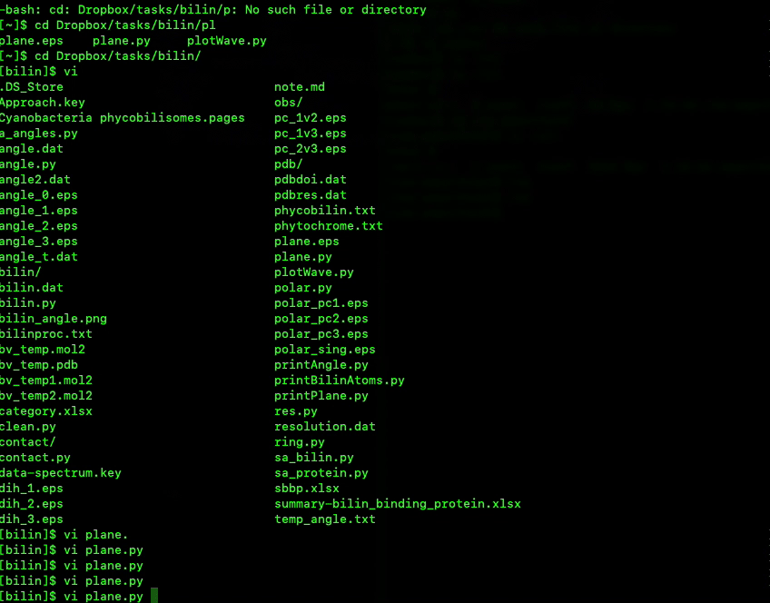

# Smartfold -- fold unwanted text when you search

Vim's slash search (`/<search keyword>`) is great.  But it can become tedious to
go through all search results by clicking `N` or `<shift>-N` a dozen of times to
find what you want.  It will be nice to have an overview of all lines that match
the keyword but hide everything else.  `vim-smartfold` does exactly that.  



## Installation

* Download the repository: `git clone https://github.com/carbonscott/vim-smartfold`
* Place it in a path where you keep your vim plugins, e.g. `$HOME/.vim/plugins` 
* Include the following line of code in your `.vimrc`: 
  `source $HOME/.vim/plugins/vim-smartfold/smartfold.vim`


## Usage

* `[s` to trigger a prompt at the bottom left of the window
* Type the keyword you want to search and `<Enter>`.  


## Extra tips

In order to make it easy to unfold and fold hidden text, I recommend the following
key mappings set up in your `.vimrc`.  If you place the cursor on the hidden
lines of text, then `=` unfolds hidden text and `-` folds text again.  

```{.vimscrip}
nnoremap = zo
nnoremap - zc
```
